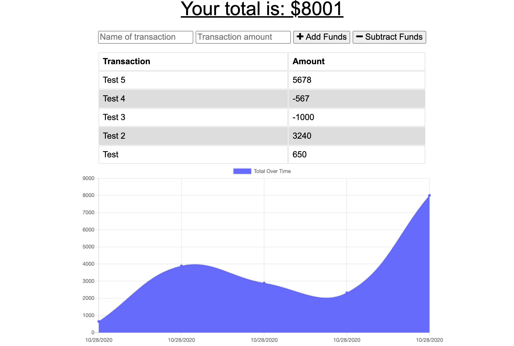

# budget-tracker

## Description 

This project is a web app that will allow the user to keep track of their budget. They can add in or remove dollar amounts from their balance, and they will see a graph of their transactions over time. It also works offline, and when the user goes back online then the app will update.

## Table of Contents

* [Installation](#installation)
* [Usage](#usage)
* [Credits](#credits)
* [License](#license)

## Installation
The user does not need to install anything to use this application if they choose to use the deployed Heruko application. This can be accessed [here](https://safe-springs-30942.herokuapp.com/).

However, if the user wants to locally host the app, they must download the files from this repository. Those can be accessed [here](https://github.com/patrickhannan/budget-tracker).

Once the user downloads these files, they must open the files in VS Code. In VS Code, the user will run a new terminal. In the terminal, the user will change their working directory to the current directory. 

Run "npm install" to install the app.

## Usage 
*If the user uses the app locally, run the command npm start in the terminal, then open localhost:3000 in a web browser.* 

Once in the app, the user will see a form with sections for name of the transaction, its amount, and buttons for whether it is a deposit or a withdrawal. The user will enter this amount, and then the graph below will update, along with the budget total at the top of the page. They will see all transactions in a list for as well

Below is a image of how the add workout form will look.

## Credits

* [Jonathan Watson](https://github.com/jonathanjwatson)

## License

MIT License

Copyright (c) 2020 Patrick Hannan

Permission is hereby granted, free of charge, to any person obtaining a copy of this software and associated documentation files (the "Software"), to deal in the Software without restriction, including without limitation the rights to use, copy, modify, merge, publish, distribute, sublicense, and/or sell copies of the Software, and to permit persons to whom the Software is furnished to do so, subject to the following conditions:

The above copyright notice and this permission notice shall be included in all copies or substantial portions of the Software.

THE SOFTWARE IS PROVIDED "AS IS", WITHOUT WARRANTY OF ANY KIND, EXPRESS OR IMPLIED, INCLUDING BUT NOT LIMITED TO THE WARRANTIES OF MERCHANTABILITY, FITNESS FOR A PARTICULAR PURPOSE AND NONINFRINGEMENT. IN NO EVENT SHALL THE AUTHORS OR COPYRIGHT HOLDERS BE LIABLE FOR ANY CLAIM, DAMAGES OR OTHER LIABILITY, WHETHER IN AN ACTION OF CONTRACT, TORT OR OTHERWISE, ARISING FROM, OUT OF OR IN CONNECTION WITH THE SOFTWARE OR THE USE OR OTHER DEALINGS IN THE SOFTWARE.